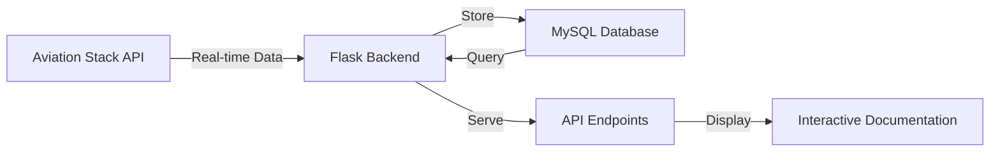

# ✈️ EU Flight Monitor

A comprehensive system for monitoring flights across European airports and tracking delays for passenger compensation claims.

## 🌐 Live Demo & Repository
- **GitHub Repository**: [EU_FLIGHT2](https://github.com/surajgupta101/EU_FLIGHT2)
- **Database**: Hosted on freesqldatabase.com
- **API Documentation**: Available at `/` endpoint when running the application

## Overview

EU Flight Monitor is a Flask-based API that collects, stores, and provides real-time flight information from European airports. The system is designed to help identify flights delayed by more than 2 hours, assisting passengers in filing compensation claims under EU regulations.

## 📸 Screenshots

### Interactive API Documentation

*Explore and test API endpoints through our interactive documentation*

### Live Flight Tracking Dashboard

*Monitor real-time flight status and updates across European airports*

### Delay Monitoring System

*Track and analyze flight delays for compensation claims*

### Airport Information Portal

*Access comprehensive airport data and flight schedules*

## 🌟 Key Features

- **Real-time Flight Tracking**
  - Live flight status updates via Aviation Stack API
  - Comprehensive flight details including delays, gates, and terminals
  - Support for filtering by airline and limiting results
  - Real-time status monitoring and updates
  - Automatic delay detection and tracking

- **Cloud Database Integration**
  - Integrated with freesqldatabase.com for cloud storage
  - Automatic data synchronization between API and database
  - Real-time data persistence for all flight updates
  - Scalable cloud-based storage solution
  - Secure remote database access

- **Airport Management**
  - Database of European airports with IATA/ICAO codes
  - Geographical information including coordinates and timezones
  - Flight schedules for specific airports
  - Interactive airport search and filtering

## 🚀 Quick Start

1. Clone the repository:
   ```bash
   git clone https://github.com/surajgupta101/EU_FLIGHT2.git
   cd EU_FLIGHT2
   ```

2. Install dependencies:
   ```bash
   pip install -r requirements.txt
   ```

3. Set up environment variables in `.env`:
   ```env
   MYSQL_USER=your_freesql_username
   MYSQL_PASSWORD=your_freesql_password
   MYSQL_HOST=sql12.freesqldatabase.com
   MYSQL_DATABASE=your_database_name
   AVIATION_API_KEY=your_aviation_stack_api_key
   ```

4. Initialize the database:
   ```bash
   flask db upgrade
   ```

5. Run the application:
   ```bash
   python eu_flight/src/app.py
   ```

6. Access the API documentation:
   - Open `http://127.0.0.1:5000/` in your browser
   - Try the interactive API endpoints

## 🛠️ System Architecture

### Data Flow


### Database Schema

The system uses MySQL with the following main tables:

1. **Airports Table**
```sql
CREATE TABLE airports (
    iata_code CHAR(3) PRIMARY KEY,
    icao_code CHAR(4) UNIQUE,
    name VARCHAR(100) NOT NULL,
    city VARCHAR(50) DEFAULT 'Unknown',
    country VARCHAR(50) DEFAULT 'Unknown',
    latitude FLOAT,
    longitude FLOAT,
    timezone VARCHAR(50)
);
```

2. **Airlines Table**
```sql
CREATE TABLE airlines (
    airline_id INT AUTO_INCREMENT PRIMARY KEY,
    name VARCHAR(100) DEFAULT 'Unknown Airline',
    iata_code CHAR(2) UNIQUE,
    icao_code CHAR(3) UNIQUE,
    country VARCHAR(50) DEFAULT 'Unknown',
    active BOOLEAN DEFAULT TRUE
);
```

3. **Flights Table**
```sql
CREATE TABLE flights (
    flight_id INT AUTO_INCREMENT PRIMARY KEY,
    flight_number VARCHAR(10) NOT NULL,
    airline_id INT NOT NULL,
    departure_airport CHAR(3),
    arrival_airport CHAR(3),
    scheduled_departure DATETIME NOT NULL,
    scheduled_arrival DATETIME,
    status VARCHAR(20) NOT NULL DEFAULT 'SCHEDULED',
    delay_minutes INT DEFAULT 0,
    FOREIGN KEY (airline_id) REFERENCES airlines(airline_id),
    FOREIGN KEY (departure_airport) REFERENCES airports(iata_code),
    FOREIGN KEY (arrival_airport) REFERENCES airports(iata_code)
);
```

### Data Collection Strategy

1. **Airport Data**:
   - Primary source: Curated JSON database (`airports.json`)
   - Regular updates through aviation authorities' official data
   - Manual verification for data accuracy

2. **Flight Data**:
   - Real-time data from Aviation Stack API
   - Periodic polling (every 5-15 minutes)
   - Backup data sources for redundancy

3. **Delay Monitoring**:
   - Continuous tracking of flight status updates
   - Automatic flagging of delays > 120 minutes
   - Historical delay data maintenance

## 📡 API Endpoints

### Airport Information
- `GET /airports`: List all European airports
- `GET /airports/{airport_code}/flights`: Get flights for specific airport

### Flight Monitoring
- `GET /api/flights/live`: Get real-time flight data
- `GET /flights/delayed`: List flights delayed > 2 hours
- `GET /flights/active`: List all active flights
- `GET /flights/{flight_id}`: Get specific flight details
- `GET /flights/search/{flight_number}`: Search flight by number

### Statistics
- `GET /api/stats/delays`: Get delay statistics by airline

## 🔒 Security Measures

- API key authentication
- Rate limiting
- HTTPS encryption
- Regular security audits
- Data backup and recovery procedures
- SQL injection prevention
- Input validation
- Secure password storage
- CORS protection

## 🚀 Deployment

### Deploy to Vercel (Recommended)

1. Install Vercel CLI:
   ```bash
   npm install -g vercel
   ```

2. Login to Vercel:
   ```bash
   vercel login
   ```

3. Deploy the application:
   ```bash
   vercel
   ```

4. For production deployment:
   ```bash
   vercel --prod
   ```

The application is already configured for Vercel deployment with the `vercel.json` file. Vercel provides:
- Zero configuration required
- Automatic HTTPS
- Continuous deployment from GitHub
- Serverless architecture
- Built-in CDN
- Real-time logs and monitoring

⚠️ **Security Note**: Never commit sensitive credentials to version control. Always use environment variables for sensitive information.

## 🔄 Future Enhancements

1. Machine learning for delay prediction
2. Mobile app for passenger notifications
3. Integration with airline compensation systems
4. Extended coverage to non-EU airports
5. Real-time weather impact analysis
6. Flight path visualization
7. Passenger compensation calculator

## 👥 Contributors

- [Suraj Gupta](https://github.com/surajgupta101) - Initial work and development

## 📝 License

This project is licensed under the MIT License - see the [LICENSE](LICENSE) file for details.

---
⭐ Don't forget to star this repository if you found it helpful!
