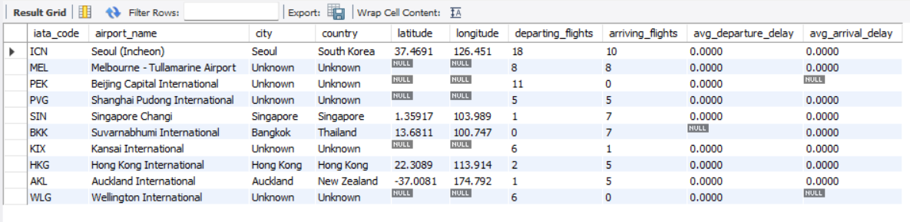

# ✈️ EU Flight Monitor

A comprehensive real-time flight monitoring system designed to track European flights and identify delays for passenger compensation claims. This project provides real-time flight data through a RESTful API, with a focus on monitoring flights delayed by more than 2 hours.


## 🌟 Key Features

- **Real-time Flight Tracking**
  - Live flight status updates via Aviation Stack API
  - Comprehensive flight details including delays, gates, and terminals
  - Support for filtering by airline and limiting results
  - Real-time status monitoring and updates
  - Automatic delay detection and tracking

- **Airport Management**
  - Database of European airports with IATA/ICAO codes
  - Geographical information including coordinates and timezones
  - Flight schedules for specific airports
  - Interactive airport search and filtering

- **Delay Monitoring System**
  - Automatic detection of flights delayed by >2 hours
  - Historical delay tracking and statistics
  - Delay reason documentation
  - Compensation claim eligibility checking
  - Real-time delay notifications

- **Interactive API Documentation**
  - Swagger-like interface for API exploration
  - Built-in API testing capabilities
  - Detailed endpoint documentation
  - Live request/response examples

## 🗄️ Database Schema

### 1. Airports Table
```sql
CREATE TABLE airports (
    iata_code CHAR(3) PRIMARY KEY,
    icao_code CHAR(4) UNIQUE,
    name VARCHAR(100) NOT NULL,
    city VARCHAR(50) DEFAULT 'Unknown',
    country VARCHAR(50) DEFAULT 'Unknown',
    latitude FLOAT,
    longitude FLOAT,
    timezone VARCHAR(50)
);
```

### 2. Airlines Table
```sql
CREATE TABLE airlines (
    airline_id INT AUTO_INCREMENT PRIMARY KEY,
    name VARCHAR(100) DEFAULT 'Unknown Airline',
    iata_code CHAR(2) UNIQUE,
    icao_code CHAR(3) UNIQUE,
    country VARCHAR(50) DEFAULT 'Unknown',
    active BOOLEAN DEFAULT TRUE
);
```

### 3. Flights Table
```sql
CREATE TABLE flights (
    flight_id INT AUTO_INCREMENT PRIMARY KEY,
    flight_number VARCHAR(10) NOT NULL,
    airline_id INT NOT NULL,
    departure_airport CHAR(3),
    arrival_airport CHAR(3),
    scheduled_departure DATETIME NOT NULL,
    scheduled_arrival DATETIME,
    status VARCHAR(20) NOT NULL DEFAULT 'SCHEDULED',
    delay_minutes INT DEFAULT 0,
    FOREIGN KEY (airline_id) REFERENCES airlines(airline_id),
    FOREIGN KEY (departure_airport) REFERENCES airports(iata_code),
    FOREIGN KEY (arrival_airport) REFERENCES airports(iata_code)
);
```

## 🛠️ Technology Stack

- **Backend**: Python Flask
- **Database**: MySQL 8.0+
- **External API**: Aviation Stack
- **Documentation**: Interactive HTML/CSS/JS
- **ORM**: SQLAlchemy
- **Environment**: Python 3.8+

## 📊 Data Flow Architecture


## 🚀 Installation

1. Clone the repository:
   ```bash
   git clone https://github.com/yourusername/eu_flight.git
   cd eu_flight
   ```

2. Create and activate a virtual environment:
   ```bash
   python -m venv venv
   source venv/bin/activate  # Linux/macOS
   venv\Scripts\activate     # Windows
   ```

3. Install dependencies:
   ```bash
   pip install -r requirements.txt
   ```

4. Configure environment variables:
   ```bash
   cp .env.example .env
   # Edit .env with your configuration:
   # MYSQL_USER=your_user
   # MYSQL_PASSWORD=your_password
   # MYSQL_HOST=localhost
   # MYSQL_DATABASE=eu_flight
   # AVIATION_API_KEY=your_api_key
   ```

5. Initialize the database:
   ```bash
   mysql -u root -p < eu_flight/src/database/schema.sql
   mysql -u root -p < eu_flight/src/database/sample_data.sql
   ```

## 📸 Screenshots

### API Documentation Interface


### Live Flight Tracking


### Delay Monitoring Dashboard


### Airport Information


## 📊 Sample Queries

### Get Delayed Flights
```sql
SELECT 
    f.flight_number,
    al.name AS airline,
    dep.city AS departure_city,
    arr.city AS arrival_city,
    f.scheduled_departure,
    f.delay_minutes
FROM flights f
JOIN airlines al ON f.airline_id = al.airline_id
JOIN airports dep ON f.departure_airport = dep.iata_code
JOIN airports arr ON f.arrival_airport = arr.iata_code
WHERE f.delay_minutes > 120
ORDER BY f.delay_minutes DESC;
```

## 🔒 Security Features

- API key authentication
- SQL injection prevention
- Input validation
- Error handling
- Secure password storage
- Rate limiting
- CORS protection

## 🚧 Future Enhancements

1. Machine learning for delay prediction
2. Mobile app development
3. Email notifications for delays
4. Extended airport coverage
5. Weather impact analysis
6. Real-time flight path visualization
7. Passenger compensation calculator

## 👥 Authors

- Suraj Gupta - Initial work and development

## 🙏 Acknowledgments

- Aviation Stack API for flight data
- Flask community for the web framework
- SQLAlchemy team for the ORM
- All contributors and testers

## 📝 License

This project is licensed under the MIT License - see the [LICENSE](LICENSE) file for details.

---
⭐ Don't forget to star this repository if you found it helpful!

